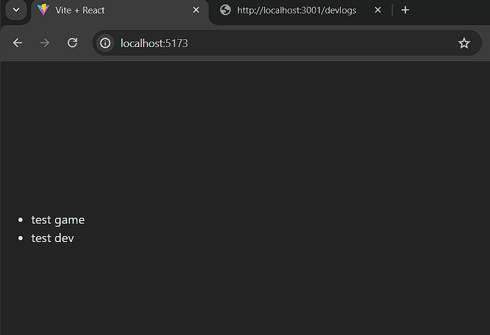
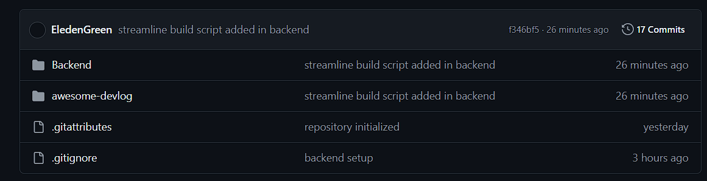
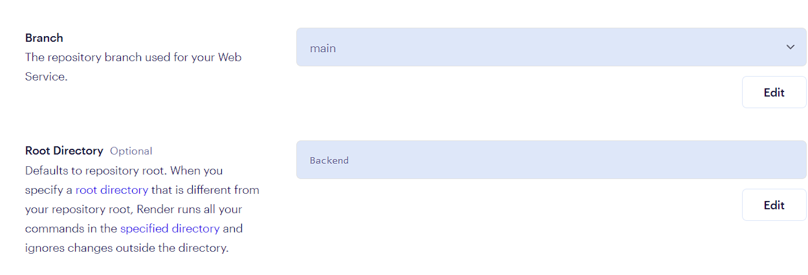

# Project Documentation

## Table of Contents

- [Frontend](#frontend)
  - [Configuration](#configuration)
    - [Initialize Repository](#initialize-repository)
    - [Install Vite React Template](#install-vite-react-template)
    - [Install Prettier](#install-prettier)
    - [Install Axios](#install-axios)
    - [Install JSON Server](#install-json-server)
    - [Install Redux Toolkit](#install-redux-toolkit)
    - [Tailwind CSS for Vite Framework](#tailwind-css-for-vite-framework)
  - [Define devReducer.jsx](#define-devreducerjsx)
  - [Define store.jsx](#define-storejsx)
  - [Error Encountered](#error-encountered)
  - [Testing](#testing)
  - [Tailwind CSS Style Added](#tailwind-css-style-added)
  - [URL Redirect Implemented](#url-redirect-implemented)
  - [Filter Button](#filter-button)
    - [Define filterReducer](#define-filterreducer)
    - [Update Store](#update-store)
    - [Filter Component](#filter-component)
    - [Implement in Devlog Listing](#implement-in-devlog-listing)
  - [Navigation Bar](#navigation-bar)
  - [Footer](#footer)
- [Backend](#backend)
  - [Configuration](#configuration-1)
    - [Initialize Node](#initialize-node)
    - [Install Express](#install-express)
    - [Database Configuration](#database-configuration)
    - [Configure index.js](#configure-indexjs)
  - [Errors Solved](#errors-solved)
- [Deployment to Render](#deployment-to-render)

## Frontend

### Configuration

#### Initialize Repository
```shell
git init
```

#### Install Vite React Template
```shell
npm create vite@latest awesome-devlogs -- --template react
```

#### Install Prettier
```shell
npm install eslint-config-prettier
```

#### Install Axios
```shell
npm install axios
```

#### Install JSON Server
- For frontend testing:
  ```shell
  npm install json-server --save-dev
  ```
- Add the following script to `package.json`:
  ```json
  "scripts": {
    "server": "json-server -p3001 --watch db.json"
  }
  ```

#### Install Redux Toolkit
```shell
npm install redux
npm install react-redux
npm install @reduxjs/toolkit
```

#### Tailwind CSS for Vite Framework
```shell
npm install -D tailwindcss postcss autoprefixer
npx tailwindcss init -p
```
- In your `tailwind.config.js` file:
  ```javascript
  /** @type {import('tailwindcss').Config} */
  export default {
    content: [
      "./index.html",
      "./src/**/*.{js,ts,jsx,tsx}",
    ],
    theme: {
      extend: {},
    },
    plugins: [],
  }
  ```
- Add the `@tailwind` directives for each of Tailwind’s layers to your `./src/index.css` file:
  ```css
  @tailwind base;
  @tailwind components;
  @tailwind utilities;
  ```

### Define _devReducer.jsx_
```jsx
import { createSlice } from '@reduxjs/toolkit'
import devService from '../services/devlogs'

const devSlice = createSlice({
  name: 'devlogs',
  initialState: [],
  reducers: {
    setDevlogs(state, action) {
      return action.payload
    },
  },
})

export const { setDevlogs } = devSlice.actions

export const initialDevlogs = () => {
  return async (dispatch) => {
    const devlogs = await devService.getAll()
    console.log(devlogs)
    dispatch(setDevlogs(devlogs))
  }
}

export default devSlice.reducer
```

### Define _store.jsx_
```jsx
import { configureStore } from '@reduxjs/toolkit'
import devReducer from './reducers/devReducer'

const store = configureStore({
  reducer: {
    devlogs: devReducer,
  },
})

export default store
```

### Error Encountered
- The name of **state** in **store** should be the same as in the **reducer**:
  ```jsx
  const devSlice = createSlice({
    name: 'devlogs',
  ```
  ```jsx
  const store = configureStore({
    reducer: {
      devlogs: devReducer,
  ```
- Access it appropriately:
  ```jsx
  const devlogs = useSelector((state) => state.devlogs)
  ```

### Testing
- Create and initialize `db.json` in the root directory.
- Then start the server:
  ```shell
  npm run server
  ```
- Start the frontend:
  ```shell
  npm run dev
  ```
- Working:
  - 

### Tailwind CSS Style Added

### URL Redirect Implemented
```jsx
<a
  href={devlog.url}
  key={devlog.id}
  target="_blank"
  rel="noopener noreferrer"
>
```
- Here, `target="_blank"` specifies that the link should open in a new tab, and `rel="noopener noreferrer"` is a security measure to prevent the new page from gaining access to the `window.opener` property.

### Filter Button

#### Define **filterReducer**
```jsx
import { createSlice } from '@reduxjs/toolkit'

const filterSlice = createSlice({
  name: 'filter',
  initialState: 'ALL',
  reducers: {
    setFilter(state, action) {
      return action.payload
    },
  },
})

export const { setFilter } = filterSlice.actions
export default filterSlice.reducer
```

#### Update **store**
```jsx
import { configureStore } from '@reduxjs/toolkit'
import devReducer from './reducers/devReducer'
import filterReducer from './reducers/filterReducer'

const store = configureStore({
  reducer: {
    devlogs: devReducer,
    filter: filterReducer,
  },
})

export default store
```

#### Filter Component
```jsx
// ...
const activeFilter = useSelector((state) => state.filter)

const getButtonClass = (filter) => {
  return `px-2 py-1 text-sm rounded-full focus:outline-none transition duration-300 ease-in-out ${
    activeFilter === filter
      ? 'bg-blue-500 text-white'
      : 'bg-transparent text-slate-300 border border-gray-300 hover:bg-gray-500'
  }`
}

return (
  <div className="ml-4 mt-4 flex space-x-2">
    <button
      onClick={() => dispatch(setFilter('ALL'))}
      className={getButtonClass('ALL')}
    >
// ...
```
- Here, _activeFilter_ stores the current _state_ of the `filter`.
- `className` will have a value (which is a Tailwind CSS class value) as per the _state/value_ of the `filter`.

#### Implement in Devlog Listing
```jsx
const Devlog = () => {
  const devlogs = useSelector(({ filter, devlogs }) => {
    if (filter === 'ALL') {
      return devlogs
    }
    return filter === 'LOGS'
      ? devlogs.filter((devlog) => devlog.type === 'logs')
      : devlogs.filter((devlog) => devlog.type === 'blogs')
  })

  console.log(devlogs)
  return (
    <div className="p-4">
      {devlogs.map((devlog) => (
// ...
```

### Navigation Bar
- This is a dynamic design where it collapses for smaller screens.
  ```jsx
  import { useState } from 'react'

  const NavigationBar = () => {
    const [isOpen, setIsOpen] = useState(false)

    return (
      <nav className="bg-transparent-700 p-4">
        <div className="max-w-7xl mx-auto flex justify-between items-center">
          <div className="text-white text-lg font-semibold">
            Best dev logs & blogs
          </div>
          <div className="md:hidden">
            <button
              onClick={() => setIsOpen(!isOpen)}
              className="text-gray-300 focus:outline-none"
            >
              <svg
                className="w-6 h-6"
                fill="none"
                stroke="currentColor"
                viewBox="0 0 24 24"
                xmlns="http://www.w3.org/2000/svg"
              >
                <path
                  strokeLinecap="round"
                  strokeLinejoin="round"
                  strokeWidth="2"
                  d={
                    isOpen
                      ? 'M6 18L18 6M6 6l12 12'
                      : 'M4 6h16M4 12h16m-7 6h7'
                  }
                ></path>
              </svg>
            </button>
          </div>
          <ul
            className={`md:flex space-x-4 ${
              isOpen ? 'block' : 'hidden'
            } md:block`}
          >
            <li>
              <a href="#" className="text-gray-300 hover:text-white">
                Documentation
              </a>
            </li>
          </ul>
        </div>
        <hr className="border-gray-300 my-4" />
      </nav>
    )
  }

  export default NavigationBar

### Footer
```jsx
const Footer = () => {
  return (
    <footer className="bg-transparent text-gray-300 py-4 mt-20">
      <hr className="border-gray-300 my-4" />
      <div className="max-w-7xl mx-auto flex justify-center px-4">
        <div className="flex space-x-4">
          <p>Share your favorite logs/blogs by making a PR</p>
          <a href=""></a>
        </div>
      </div>
    </footer>
  )
}

export default Footer
```

## Backend

### Configuration

#### Initialize Node
```shell
npm init
```
- To start the server with watch mode:
  ```shell
  node --watch index.js
  ```

#### Install Express
```shell
npm install express
```
- Additionally, install async error handling and CORS support:
  ```shell
  npm install express-async-errors
  npm install cors
  ```

#### Configure ESLint
```shell
npm init @eslint/config@latest
npm install --save-dev eslint-config-prettier
```

### Database Configuration
- Get the connection link and password for Cluster 0.
- Install Mongoose and dotenv:
  ```shell
  npm install mongoose
  npm install dotenv
  ```
- Create a `.env` file and set up `URI` and `PORT`.

### Configure index.js
```javascript
const app = require('./app')
const logger = require('./utils/logger')
const config = require('./utils/config')

app.listen(config.PORT, () => {
  logger.info(`Server running on port ${config.PORT}`)
})
```

### Errors Solved
- Error: http://localhost:3003/api/devs loading indefinitely
  - Solution: Add CORS middleware to `app.js`:
    ```javascript
    app.use(cors())
    ```
  - Cause: Missing `app.use(cors())`

## Deployment to Render

- Connect your GitHub repository as follows:
  - 
- Change the root repository in Render as needed:
  - 

---
